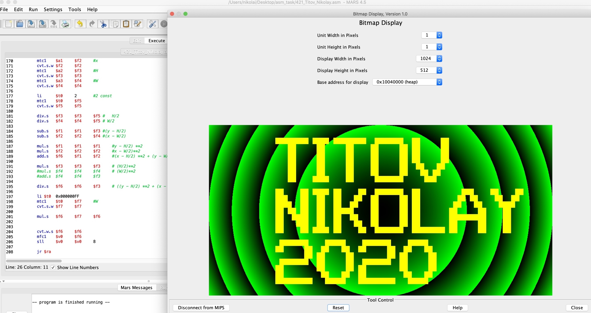

#MIPS Graphics 

Using MIPS Assembly and MIPS emulator called MARS gradient graphics with text was created.
Using heap memory addr to mapping picture data.

The single code file consists of:
* main .text section where is two cycles to draw image on X and Y coordinates
* Function Img2Matrix which scales rendered image to text implementation of picture 
  to know what to draw -- letter or background
* Function GMemShift needed to calculate  shift in heap to map dot of picture
* NormalDistanse - function calculates squared distance from current dot to image center dot, 
divides it on 1/4 part of squared image height.Then it multplies on green color in bytes.

Here's list of distrib:
* Mars4_5.jar -- emulator using to edit and compile run code in emulator
* graphics_bitmap_mips.asm -- single code  file
* mips_result.jpg -- result jpg picture
